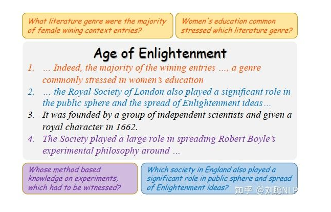
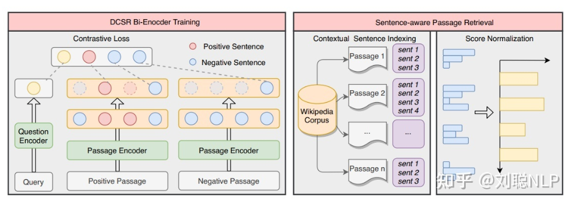
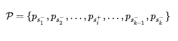
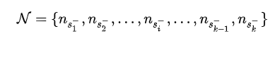
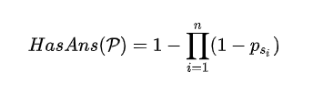
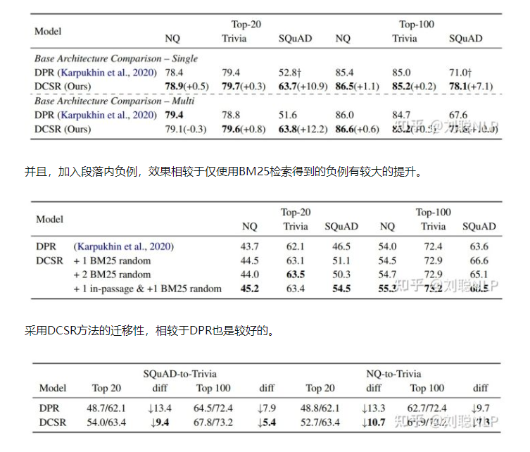

# 【关于 DCSR】 那些你不知道的事

> 作者：杨夕
> 
> 项目地址：https://github.com/km1994/nlp_paper_study
> 
> 论文：《Sentence-aware Contrastive Learning for Open-Domain Passage Retrieval》
> 
> 会议：ACL2022
> 
> paper地址：https://aclanthology.org/2022.acl-long.76.pdf
> 
> code地址：https://github.com/chengzhipanpan/DCSR
> 
> 个人介绍：大佬们好，我叫杨夕，该项目主要是本人在研读顶会论文和复现经典论文过程中，所见、所思、所想、所闻，可能存在一些理解错误，希望大佬们多多指正。

## 一、动机

在检索任务中，通常正例样本为问题query对应的正确段落，而通过BM25等方法构建一些难负例，通过问题query靠近正例样本，远离负例样本，获取更好的问题和段落的向量表征。

但是目前的对比学习框架，都忽略了一个至关重要的问题，如下图所示，**每一个段落由多个句子组成，而每个句子对应的问题可能在语义上差别很大**。这种一对多的关系，造成了学习过程中的冲突：

1. **「相似性传递」**：对比学习框架的目标是**使问题的向量表征与其对应的黄金段落的向量表征之间的相似性最大**。而这种一对多的关系，会**造成同一个段落中语义差异很大的不同问题之间的向量表征极其相似**。
2. **「样本即正亦负」**：对比学习框架中大批次是一个很重要的参数，而这种一对多的关系，会造成**一个批次中包含同一个段落对应的多个问题，导致一个段落对于相同问题即使正样本也是负样本**。

## 二、核心思想

1. 用两个预训练模型分别对问题query和段落内容passage进行编码，在每个段落中句子前插入一个特殊的<sent>标记；
2. 「为了保留文本上下文的信息」，将段落内容作为一个整体输入到编码器中进行编码，<sent>取标记对应的向量作为句子向量。

## 三、正负例 构建

- 正例构建

对于给定问题 q，在批次内的正段落为 p，包含多个句子:

> 注：包含答案的句子 Ps+ 作为训练的正例

- 简单负例获取
  
通过BM25技术，针对问题 q 从检索库中，找到与其相关的负段落，并且每个段落包含多个句子:

> 注：一部分简单负例从 N 中随机抽取，一部分简单负例使用批次内其他句子。

- 段落内负例获取
  - 动机：编码器可以使同一段落中的不同句子尽可能具有不同的上下文句子表征，并且一个段落中并非所有的句子都包含答案或者与查询问题相关；
  - 思路：引入段落内负例，以最大限度地提高同一段落中上下文句子向量表征的差异。
  - 做法：**在正段落中，随机抽取一个不包含答案的句子**。如果正段落不包含这样的句子，则从 N 中随机抽取一个简单负例做代替。

## 四、检索排序

在检索中，计算问题向量和所有上下文句子向量之间的匹配分数，由于一篇段落中有多个句子，因此检索了前 100*k 个句子进行排序，其中 k 是所有段落中句子个数的平均数。

由于最终排序结果需要展现段落排序，因此需要将上述句子级别的分数转换为段落级别的分数。先采用Softmax函数对分数进行归一化，然后对于每篇段落的分数变换如下：

其中，p 为前 100*k 个句子中在某个段落中句子的集合，psi 为每个句子对应的概率值。

最终，按照每个段落的 HasAns(P) 值进行重排序，获取真正的检索排序。

## 五、实验结果

## 六、总结

检索时通过句子级排序推理出段落级排序。并且放大同一段落中的不同句子的表征，解决了一对多时产生的相似性传递并且减少了噪音。为了使得段落间的句子可以获取相互之间的信息，使用特殊字符获取句向量，而非将每个句子独立编码。

## 参考

- [ACL2022 | DCSR：一种面向开放域段落检索的句子感知的对比学习方法](https://zhuanlan.zhihu.com/p/527366495?utm_source=wechat_session&utm_medium=social&utm_oi=1090917895634096128)

