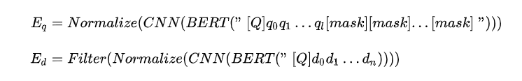

# 【关于 ColBERT】 那些你不知道的事

> 作者：杨夕
> 
> 项目地址：https://github.com/km1994/nlp_paper_study
> 
> 论文：ColBERT: Efficient and Effective Passage Search via Contextualized Late Interaction over BERT
> 
> 会议：SIGIR2020
> 
> github：
> 
> 个人介绍：大佬们好，我叫杨夕，该项目主要是本人在研读顶会论文和复现经典论文过程中，所见、所思、所想、所闻，可能存在一些理解错误，希望大佬们多多指正。
> 
> 论文地址：

## 一、动机

## 二、核心思想

- 对query与doc在token-level的编码进行匹配计算，并通过MaxSim算符取出最大值并求和作为最终的分数

## 参考

- [深度文本检索模型：DPR, PolyEncoders, DCBERT, ColBERT](https://zhuanlan.zhihu.com/p/523879656?utm_source=wechat_session&utm_medium=social&utm_oi=1090917895634096128)

