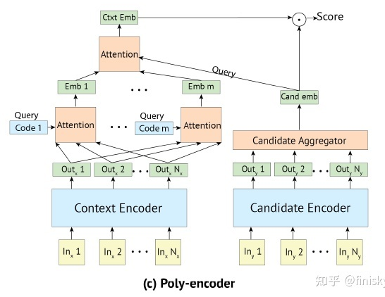

# 【关于 Poly-Encoders】 那些你不知道的事

> 作者：杨夕
> 
> 项目地址：https://github.com/km1994/nlp_paper_study
> 
> 论文：Poly-encoders：Architectures and Pre training Strategies for Fast and Accurate Multi sentence Scoring
> 
> 会议：[ICLR2020]
> 
> github：
> 
> 个人介绍：大佬们好，我叫杨夕，该项目主要是本人在研读顶会论文和复现经典论文过程中，所见、所思、所想、所闻，可能存在一些理解错误，希望大佬们多多指正。
> 
> 论文地址：

## 一、动机

- 为了解决上文提到的不能离线索引的问题，并兼顾性能；
- 那么如何让query和doc进行更为深入的交互？

## 二、核心思想

- 本质：双塔模型。
- 主要创新点：
  - 如何让query和doc进行更为深入的交互？
  - 就是在query embedding的计算上，通过训练m个独立的encoder，把query编码成m个向量并求和，再在最后一层进行交互。

**如果说full interaction是在深度上进行充分交互，Poly-Encoders则是在query宽度上进行扩展，并达到充分交互的目的。**

## 参考

- [深度文本检索模型：DPR, PolyEncoders, DCBERT, ColBERT](https://zhuanlan.zhihu.com/p/523879656?utm_source=wechat_session&utm_medium=social&utm_oi=1090917895634096128)

